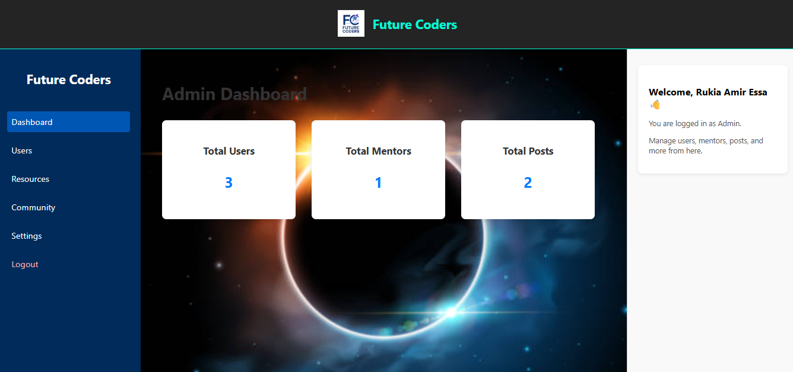
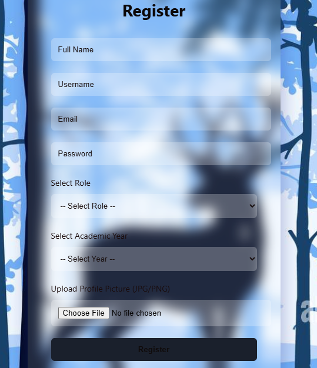

# 🌟 Future Coders Platform

Welcome to the **Future Coders Platform** — an educational collaboration system where students, mentors, and admins can connect, post updates, follow one another, and grow together through a community-based learning environment.

Hosted on: [GitHub – jjcoder-star/fc_platform](https://github.com/jjcoder-star/FC_platform)

---

## 📸 Screenshots

### dsahbaord Page  


### 🧑‍🎓 Admin Dashboard  


### 🗨️ Register Form



---

## 🚀 Features

- ✅ User registration and login (Admin, Mentor, Student)
- ✅ Post creation and feed (forums)
- ✅ Like and comment system on posts
- ✅ Follow/unfollow users
- ✅ Public profiles with bio, university, followers/following count
- ✅ Editable user profile for bio and education
- ✅ Admin panel for platform management


---

## 🛠️ Tech Stack

- **Frontend**: HTML, CSS, JavaScript  
- **Backend**: PHP  
- **Database**: MySQL  
- **Version Control**: Git + GitHub

---

## ⚙️ Setup Instructions

### 1. Clone the Repository

```bash
git clone https://github.com/jjcoder-star/fc_platform.git
cd fc_platform
